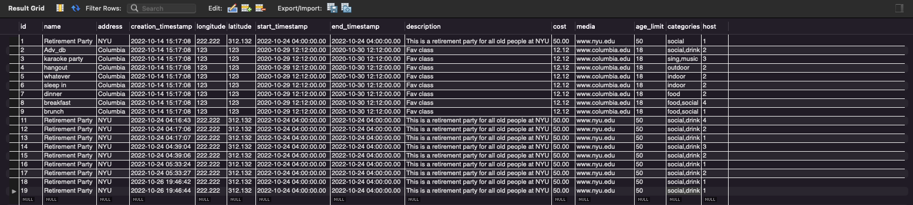
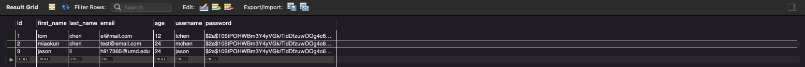
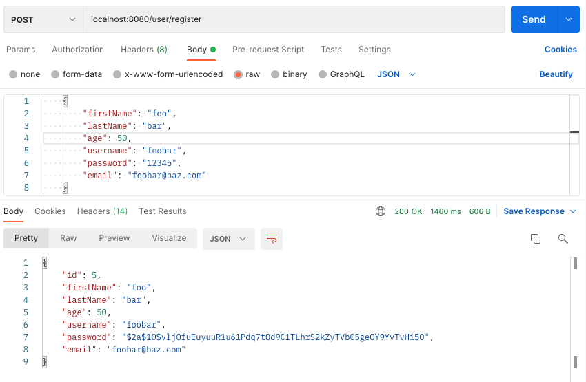
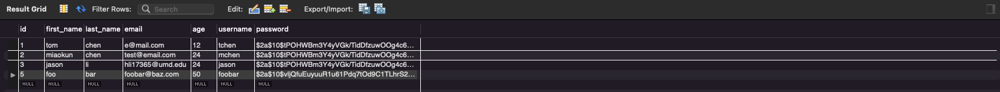
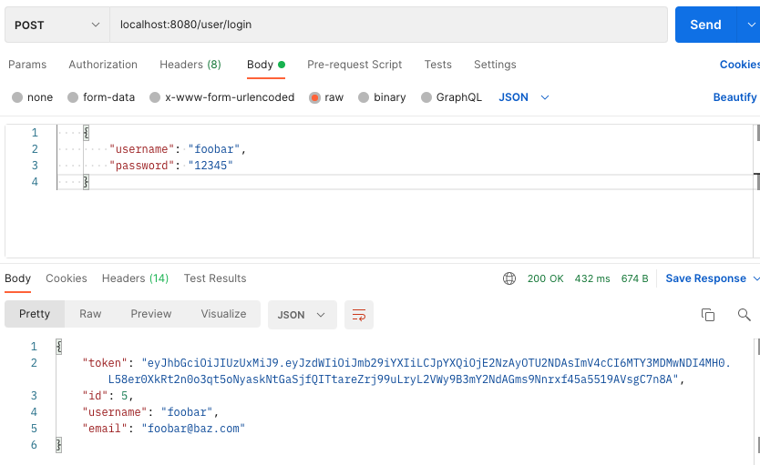
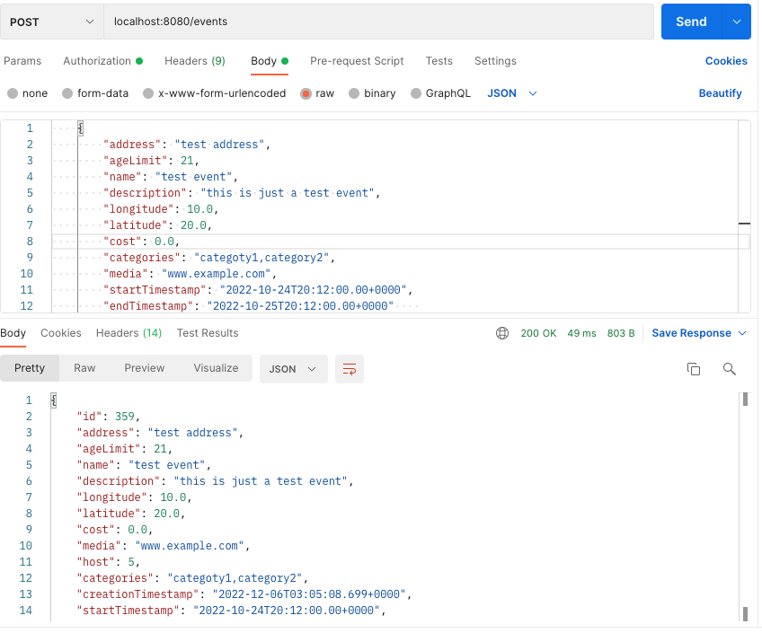
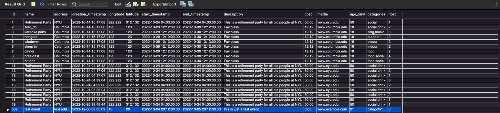
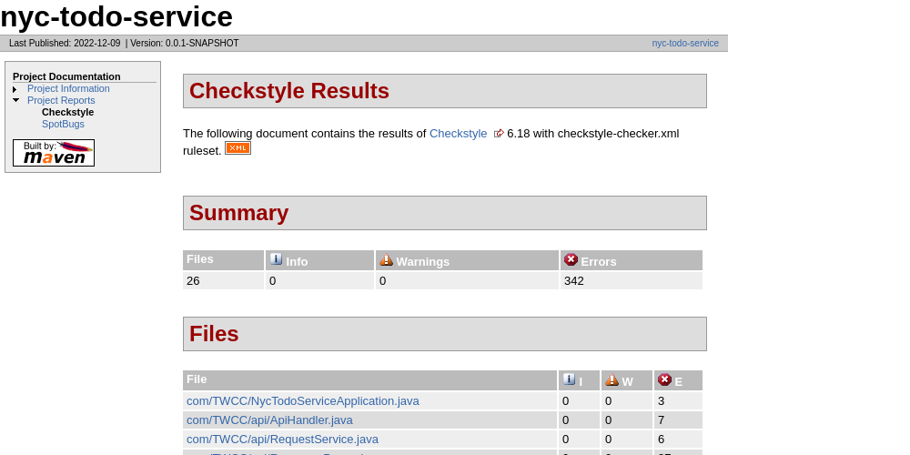
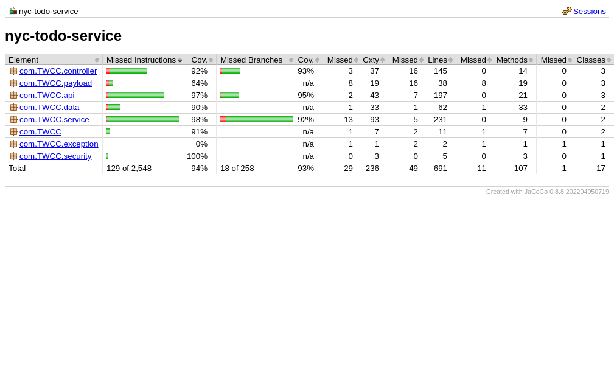

# COMS4156-TWCC

## 1. Build, Run, and Test Server
---
*Ensure that Maven is installed before these commands can be run*
> Docker setup (without having to setup Maven on your host machine):
> 1. Install Docker
> 2. Clone repo & cd to repo root directory
> 3. docker pull maven:latest
> 4. `Option 1: (Mac - zsh)` docker run -it -v $(pwd):/{root-dir-folder-name} --name {container-name} -p 8080:8080 maven:latest bash 
>       - Run maven image while mounting repo on host machine to Docker container and exposing port
> 5. `Option 2: (Windows - Powershell)` docker run -it -v ${pwd}:/app --name {container-name} -p 8080:8080 maven:latest bash
>       - Run maven image while mounting repo on host machine to Docker container and exposing port
> 6. (Optional) if exited container, start back up: docker start {container-name} -i
- Build: To build the app run `mvn install`
- Run: To run the app run `mvn spring-boot:run`
- Test (locally - requires MySQL configured with database set up): After running the app, we can access our app through the endpoints at localhost:{exposed-port} (localhost:8080) and appending any route specified in documentation (i.e. localhost:8080/events).
    - `src/main/resources/application.properties` database properties are required to run the app successfully connecting to the database. Make sure to replace placeholder values.
- Run Tests: After building the app, run `mvn test` to execute all tests in the package

## 2. Service API Documentation
---
### **Events**
- All calls need to include a valid JWT (Bearer Token), which can be obtained from `/user/login` route, in the authorization headers
- `GET /events`: Gets a list of events
    - Specify request parameters to filter returned events
        - `id` (integer)
        - `address` (string)
    - Sample Request:
        - localhost:8080/events
        - localhost:8080/events/1
        - localhost:8080/events/byaddress/Columbia
- `POST /events`: Creates an event with the specified event fields
    - Must specify request body
    - Sample Request Body: 
    ```
        {
            "address": "test address",
            "ageLimit": 21,
            "name": "test event",
            "description": "this is just a test event",
            "longitude": 10.0,
            "latitude": 20.0,
            "cost": 0.0,
            "media": "www.example.com",
            "startTimestamp": "2022-10-24T20:12:00.00+0000",
            "endTimestamp": "2022-10-25T20:12:00.00+0000"    
        }
     ```
- `PUT /events`: Updates an existing event given the event request body
    - Sample Request: localhost:8080/events
    - Must specify request body and a existing event ID in the body
    - Sample Request Body:
    ```
        {
            "id": 1,
            "address": "test address update"
        }
     ```
- `DELETE /events`: Deletes an event given an existing event ID
    - Sample Request: localhost:8080/events/1
- `GET /filterEvents`: Gets filtered list of events given event fields and values that the user wants to filter on
    - Sample Request: localhost:8080/filterEvents?address=Columbia&name=Midterm
- `GET /events/statistics`: Gets event statistics data
    - Sample Request: localhost:8080/events/statistics

### **User**
- `POST /user/register`: Registers a new user
    - Sample Request: localhost:8080/user/register
    - Must specify request body
    - Sample Request Body:
    ```
        {
            "firstName": "foo",
            "lastName": "bar",
            "age": 50,
            "username": "foobar",
            "password": "12345",
            "email": "foobar@baz.com"
        }
    ```
- `POST /user/login`: login as the specified user
    - Returns JWT upon successful login which is then to be used as an authorization mechanism in any other non `/user/**` subsequent API calls (in order to be a valid request)
    - Sample Request: localhost:8080/user/login
    - Sample Request Body:
    ```
        {
            "username": "foobar",
            "password": "12345"
        }
    ```

### **Data Generation**
- `POST /populateEvents`: Populate database with events using Ticketmaster API
    - Sample Request: localhost:8080/populateEvents
    - This is an entrypoint only available to service admin. Therefore, users will not be exposed to this entrypoint.

## 3. Integration/E2E Tests Strategy
---
Our current Integration/E2E test strategy is automated and done manually. 

Automated integration tests (in our `**/*Integration*.java` test files) are done collectively along with unit tests every time our GitHub Actions workflow is run. Our test reports are automatically generated and highlight those results ([view reports section for more detail](#4-reports)).

Manual Integration/E2E tests are also done to simulate another layer of the testing environment with a separate test database and an opportunity for a human/engineer test oracle to verify correct output. The testing flow documentation is discussed in detail below.

We have also pre-populated some data in the database before the tests. Such as the following:

Events Data:


User Data:



The following is a sample testing flow we have used to do integration and E2E tests (all being done using Postman):

### Step 1: User Creation
We send `POST /user/register` request, along with required request body (described in the above [User Route Documentation](#user) section), to the service. Then we check the database to see whether the newly created user is added to the User table. 

Request/Response:


Database:


### Step 2: User Login
We send `POST /user/login` request, along with the username and password we set in the previous step in the request body. Then, we will obtain a Json Web Token (JWT) as part of the response. We will denote such token as `<JWT>`. 

Request/Response:


### Step 3: Post Events
We send `POST /events` request, along with an event following the format described in the [Event Route Documentation](#events) section in the request body and adding `<JWT>` in the authorization header. Then we check the database to see whether the newly created event is added in the Event table. 

Request/Response:


Database:


### Step 4: Get Events
We send `GET /events` request, along with `<JWT>` in the authorization header. Then we check if the response contains all the events from the Event table, including the event we created in Step 3. 

### Step 5: Update Events
We send `PUT /events` request, along with `<JWT>` in the authorization header, and a request body containing the id of the event we created in Step 3 and one or multiple updated event attributes, following the format described in the [Event Route Documentation](#events) section. Then we use `GET /events/{id}` to check if the corresponding event is updated. 

### Step 6: Filter Events
We send `GET /events/filterEvents?<attribute1>=<value1>&<attribute2>=<value2>...`, along with `<JWT>` in the authorization header. Then we check if the response contains events fit such filter. 

### Step 7: Event Statistics
We send `GET /events/statistics`, along with `<JWT>` in the authorization header. Then we check if the response contains event statistics. 

### Step 8: Delete Events
We send `DELETE /events/{id}`, along with `<JWT>` in the authorization header. Then we send `GET /events/{id}` to see if the response is an empty array.

### Note
Please note that the above sample flow is a "Golden Path" of the service. We have also tested with ill-formatted request bodies, missing JWT, non-existant events, filters that filter out all events, etc. 

## 4. Reports
---
>- *All recent reports documents are now automated (through our GitHub Actions workflow) and published in the `service/reports/site` directory with every pull request merge into a `feature/**` branch.*
> - *All recent report images published on this README are all up-to-date as a result of our automated GitHub Actions workflow that takes screenshots of reports after they are generated.*
> - *Feature branches (`feature/**`) will get these report
updates after a PR merge (which triggers the report publishing job in our Workflow) and subsequently `main` will after the feature is merged into main.*

### Checkstyle
- Directions:
    1. In app root directory: `mvn site`
    2. Locate Checkstyle report in `target/site/checkstyle.html`
- Most recent Checkstyle run:
    

### Test Coverage
- Directions:
    1. In app root directory: `mvn clean test`
    2. Locate Checkstyle report in `target/site/jacoco/index.html`
- Most recent Jacoco coverage run:
    

### Static Analysis Bug Finder Tool
- Directions:
    1. In `service/` directory: `mvn site`
    2. Locate SpotBugs report in `target/site/spotbugs.html`
- Most recent SpotBugs coverage run:
    

### CI/CD Workflow Reports
- Any push and pull request triggers a Github Actions workflow run where each log can be located [here](https://github.com/mchen132/COMS4156-TWCC/actions/workflows/ci_cd_workflow.yml)

## 5. Client
---
- Directions to run client:
    1. (Option 1) Start server locally (includes having local MySql Database setup with all tables and application.properties setup)
    1. (Option 2) Updating API calls in client (residing in `client/src/actions`) to point to production domain URL (EC2 instance)
    2. In `client/` directory, run `npm install`
    3. In `client/` directory, run `npm start`
- Directions to build client:
    1. In `client/` directory, run `npm build`

## 6. 3rd Party Integrations (3PI)
---
### User Authentication:
- For user authentication we implemented authorization using JWT (JSON Web Token) tokens. The JWT architecture in our service application is built off of Spring Security following the guide: https://www.bezkoder.com/spring-boot-jwt-authentication/.
- A lot of the classes are extensions of the framework which make it either difficult to test or already tested by the 3PI. For this reason, some of the `security/**` files are excluded from Jacoco test coverage.