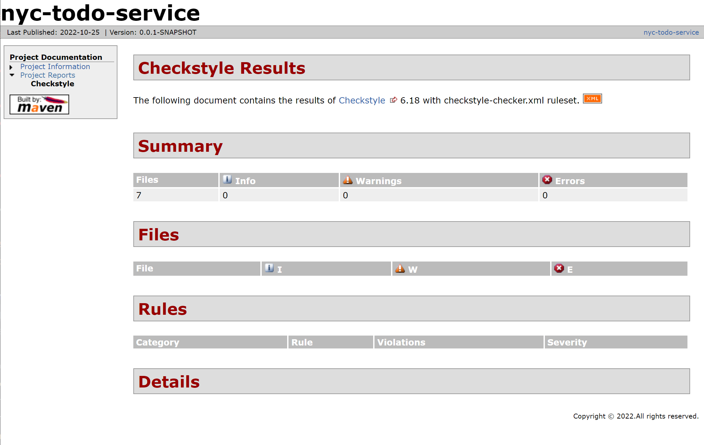
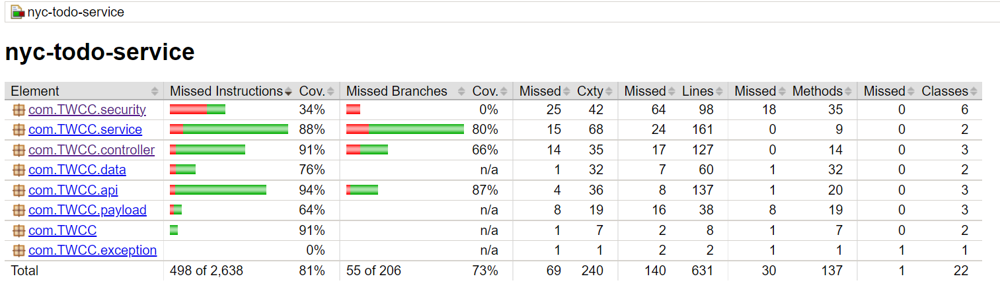
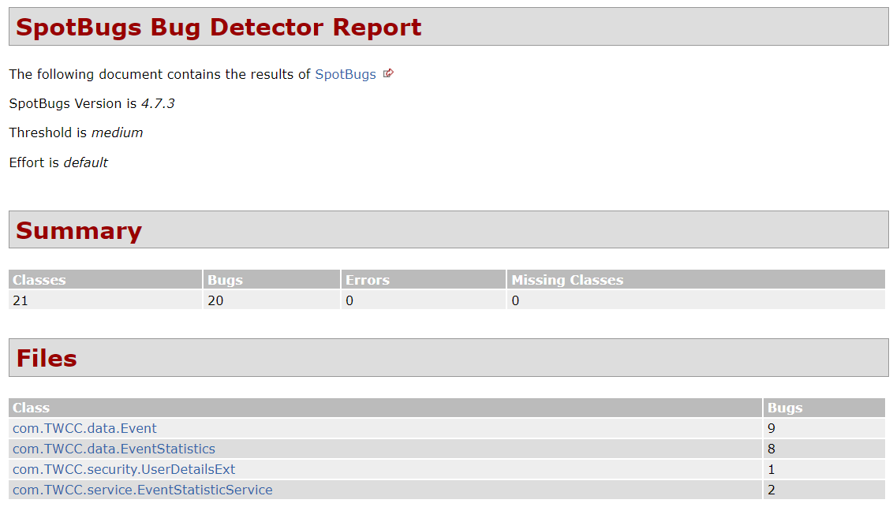

# COMS4156-TWCC

## 1. Build, Run, and Test Server
*Ensure that Maven is installed before these commands can be run*
> Docker setup (without having to setup Maven on your host machine):
> 1. Install Docker
> 2. Clone repo & cd to repo root directory
> 3. docker pull maven:latest
> 4. `Option 1: (Mac - zsh)` docker run -it -v $(pwd):/{root-dir-folder-name} --name {container-name} -p 8080:8080 maven:latest bash 
>       - Run maven image while mounting repo on host machine to Docker container and exposing port
> 5. `Option 2: (Windows - Powershell)` docker run -it -v ${pwd}:/app --name {container-name} -p 8080:8080 maven:latest bash
>       - Run maven image while mounting repo on host machine to Docker container and exposing port
> 6. (Optional) if exited container, start back up: docker start {container-name} -i
- Build: To build the app run `mvn install`
- Run: To run the app run `mvn spring-boot:run`
- Test (locally - requires MySQL configured with database set up): After running the app, we can access our app through the endpoints at localhost:{exposed-port} (localhost:8080) and appending any route specified in documentation (i.e. localhost:8080/events).
    - `src/main/resources/application.properties` database properties are required to run the app successfully connecting to the database. Make sure to replace placeholder values.
- Run Tests: After building the app, run `mvn test` to execute all tests in the package

## 2. Documentation
### **Events**
- All calls need to include a valid JWT (Bearer Token), which can be obtained from `/user/login` route, in the authorization headers
- `GET /events`: Gets a list of events
    - Specify request parameters to filter returned events
        - `id` (integer)
        - `address` (string)
    - Sample Request:
        - localhost:8080/events
        - localhost:8080/events/1
        - localhost:8080/events/byaddress/Columbia
- `POST /events`: Creates an event with the specified event fields
    - Must specify request body
    - Sample Request Body: 
    ```
        {
            "address": "test address",
            "ageLimit": 21,
            "name": "test event",
            "description": "this is just a test event",
            "longitude": 10.0,
            "latitude": 20.0,
            "cost": 0.0,
            "media": "www.example.com",
            "startTimestamp": "2022-10-24T20:12:00.00+0000",
            "endTimestamp": "2022-10-25T20:12:00.00+0000"    
        }
     ```
- `PUT /events`: Updates an existing event given the event request body
    - Sample Request: localhost:8080/events
    - Must specify request body and a existing event ID in the body
    - Sample Request Body:
    ```
        {
            "id": 1,
            "address": "test address update",
            "ageLimit": 21,
            "name": "test event update",
            "description": "this is just a test event update",
            "longitude": 10.0,
            "latitude": 20.0,
            "cost": 0.0,
            "media": "www.example.com",
            "startTimestamp": "2022-10-24T20:12:00.00+0000",
            "endTimestamp": "2022-10-25T20:12:00.00+0000"    
        }
     ```
- `DELETE /events`: Deletes an event given an existing event ID
    - Sample Request: localhost:8080/events/1
- `GET /filterEvents`: Gets filtered list of events given event fields and values that the user wants to filter on
    - Sample Request: localhost:8080/filterEvents?address=Columbia&name=Midterm
- `GET /events/statistics`: Gets event statistics data
    - Sample Request: localhost:8080/events/statistics

### **User**
- `POST /user/register`: Registers a new user
    - Sample Request: localhost:8080/user/register
    - Must specify request body
    - Sample Request Body:
    ```
        {
            "firstName": "foo",
            "lastName": "bar",
            "age": 50,
            "username": "foobar",
            "password": "12345",
            "email": "foobar@baz.com"
        }
    ```
- `POST /user/login`: login as the specified user
    - Returns JWT upon successful login which is then to be used as an authorization mechanism in any other non `/user/**` subsequent API calls (in order to be a valid request)
    - Sample Request: localhost:8080/user/login
    - Sample Request Body:
    ```
        {
            "username": "foobar",
            "password": "12345"
        }
    ```

### **Data Generation**
- `POST /populateEvents`: Populate database with events using Ticketmaster API
    - Sample Request: localhost:8080/populateEvents
    - This is an entrypoint only available to service admin. Therefore, users will not be exposed to this entrypoint.

## 3. Reports
### Checkstyle
- Directions:
    1. In app root directory: `mvn site`
    2. Locate Checkstyle report in `target/site/index.html`
- Most recent Checkstyle run: `0 warnings, 0 errors`
    

### Test Coverage
- Directions:
    1. In app root directory: `mvn clean test`
    2. Locate Checkstyle report in `target/site/jacoco/index.html`
- Most recent Jacoco coverage run: `Instruction Coverage: 81%, Branch Coverage: 73%`
    

### Static Analysis Bug Finder Tool
- Directions:
    1. In `service/` directory: `mvn site`
    2. Locate SpotBugs report in `target/site/spotbugs.html`
- Most recent SpotBugs coverage run:
    

### CI/CD Workflow Reports
- Any push and pull request triggers a Github Actions workflow run where each log can be located [here](https://github.com/mchen132/COMS4156-TWCC/actions/workflows/ci_cd_workflow.yml)

## 4. Client
- Directions to run client:
    1. (Option 1) Start server locally (includes having local MySql Database setup with all tables and application.properties setup)
    1. (Option 2) Updating API calls in client (residing in `client/src/actions`) to point to production domain URL (EC2 instance)
    2. In `client/` directory, run `npm install`
    3. In `client/` directory, run `npm start`
- Directions to build client:
    1. In `client/` directory, run `npm build`